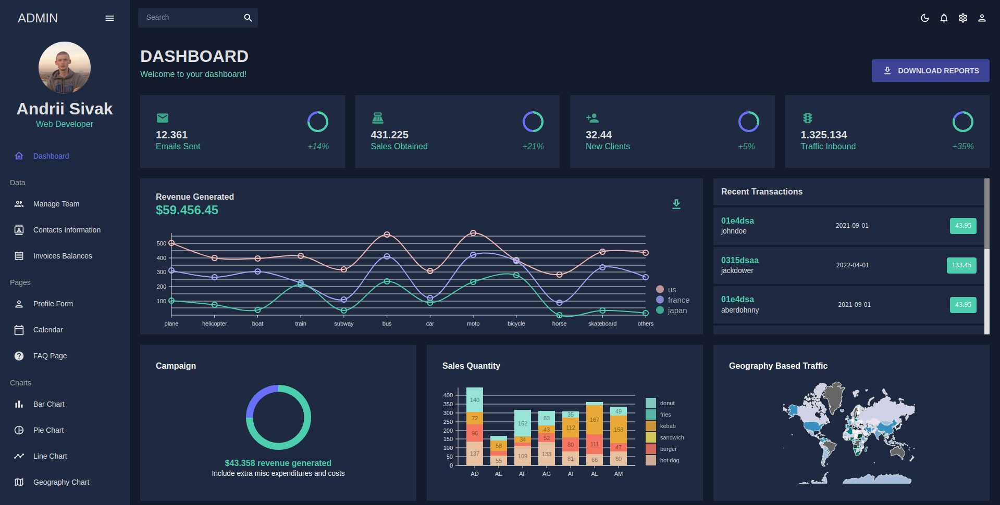
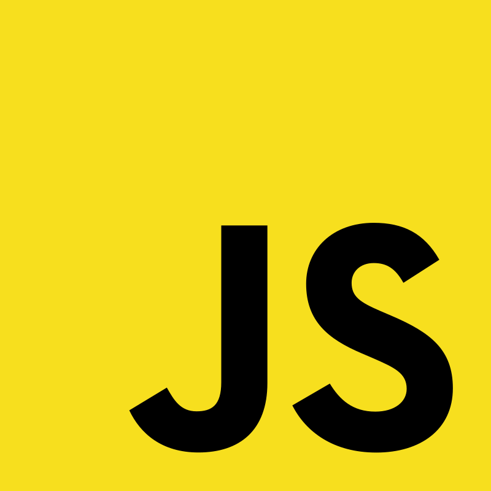
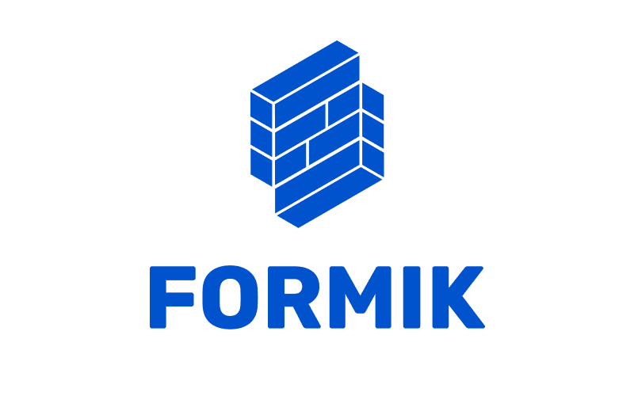

# Sample React Dashboard



## Tools Used

&nbsp;
&nbsp;
&nbsp;
&nbsp;
&nbsp;
&nbsp;
&nbsp;

✔️ JavaScript\
✔️ React\
✔️ React Router\
✔️ Material UI\
✔️ React Pro Sidebar\
✔️ Nivo Charts\
✔️ FullCalendar\
✔️ Formic+Yup

## Short description

Here you can see my experience with React and some related technologies and libs. There are many different features such as dark and light mode themes using the **Material UI**, beautiful sidebar by **React Pro Sidebar** combined navigation **React Router**, creation of various charts such as line, pie, bar charts and even a world map data-driven (now it's static json, but it can be data from API in a real life), very flexible calendar by **FullCalendar**, advanced data table included various filters by **Material UI** and also form validation by using **Formic+Yup**.

## Structure
```
├── build
├── node_modules
├── src
│   ├── components
│   │   └── reusable components
│   ├── data
│   │   └── data jsons
│   ├── sceens
│   │   └── pages
│   ├── App.js
│   ├── index.css
│   ├── index.js
│   └── theme.js
├── .gitignore
├── package.json
├── package-lock.json
└── README.md
```
---


